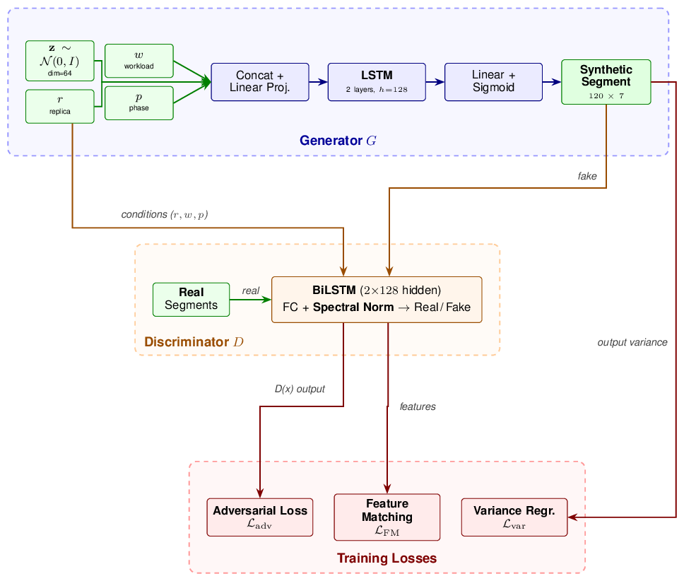
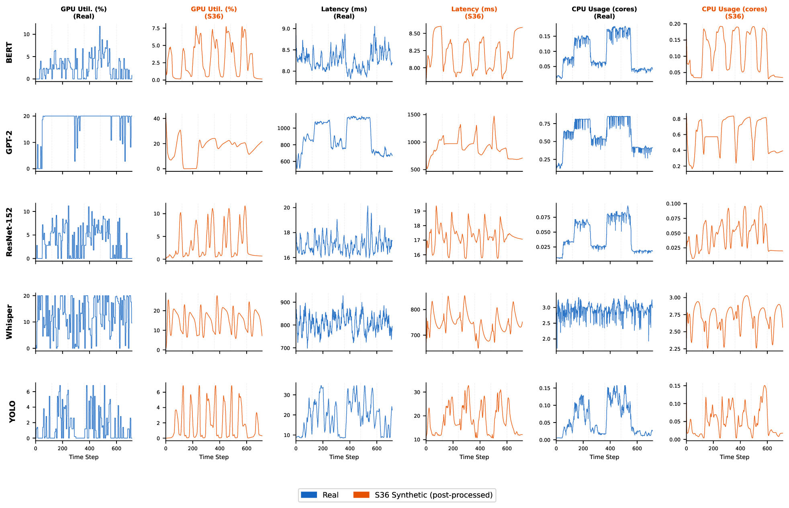
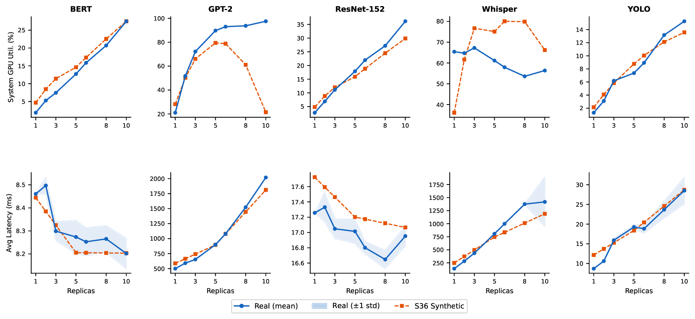
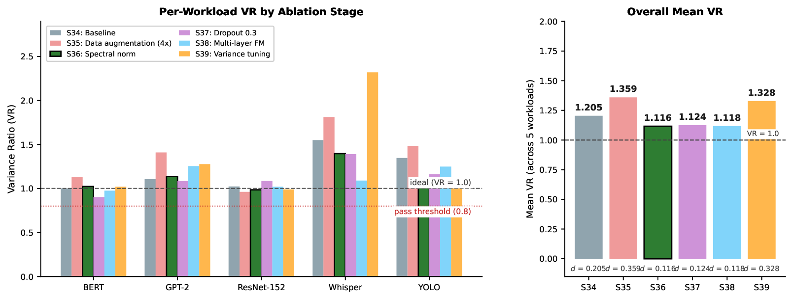

# Generative Modeling of Application Workloads for Synthetic Trace Generation

**Research Project Thesis** — Master's in Digital Transformation
**Institution**: Fachhochschule Dortmund
**Author**: Hamidreza Fathollahzadeh
**Supervisor**: Prof. Dr. Stephan Recker
**Duration**: November 2025 – May 2026

---

## Overview

This project develops a conditional generative model that learns per-pod Kubernetes
resource consumption patterns from small-scale replica experiments and synthesizes
realistic workload traces for arbitrary replica counts. The generated traces are designed
for use in Kwok-based cluster simulation, enabling scalable performance testing without
proportional physical infrastructure.

The core contribution is an encoder-free conditional TimeGAN (S36) that achieves a
mean variance ratio of 1.116 across five AI inference workloads, passing the
VR >= 0.8 acceptance threshold on all five.

---

## Results Summary

| Workload | Variance Ratio | Wasserstein | Status |
|----------|---------------|-------------|--------|
| BERT | 1.022 | 1.543 | Pass |
| GPT-2 | 1.137 | 4.736 | Pass |
| ResNet-152 | 0.985 | 2.973 | Pass |
| Whisper | 1.397 | 5.515 | Pass |
| YOLO | 1.039 | 1.197 | Pass |
| **Mean** | **1.116** | **3.193** | **5/5** |

Baseline comparison — all trained with MSE reconstruction loss:

| Model | Mean VR | Pass |
|-------|---------|------|
| LSTM Baseline | 0.613 | 0/5 |
| TimeVAE v1 | 0.613 | 0/5 |
| TimeVAE v2 | 0.517 | 0/5 |
| TimeVAE v3 | 0.148 | 0/5 |
| **TimeGAN S36** | **1.116** | **5/5** |

The LSTM and all TimeVAE variants converge at or below VR ~ 0.61 — a ceiling imposed
by MSE reconstruction loss targeting the conditional mean rather than the full
data distribution. Adversarial training breaks through this ceiling.

---

## Results at a Glance

### Architecture


*S36 architecture: encoder-free generator with segment-based LSTM, BiLSTM discriminator with spectral normalization*

### Real vs Synthetic Traces (r=5)


*Real (blue) vs S36 synthetic (orange) traces at r=5 across all five workloads*

### Scaling Curves


*Real vs synthetic scaling curves for GPU utilization and latency*

### Ablation Study


*S36 (spectral normalization) achieves the lowest deviation from ideal VR=1.0 across all ablation stages*

---

## Infrastructure

| Component | Specification |
|-----------|--------------|
| VM | Ubuntu 24.04 LTS, university-hosted |
| CPU | 16 vCPUs |
| RAM | 62.5 GB |
| GPU | NVIDIA A16, 16 GB GDDR6, Compute 8.6 (Ampere) |
| GPU Sharing | Time-slicing, 10 virtual slices |
| Kubernetes | v1.34.0, single-node |
| Container Runtime | CRI-O 1.31.5 |
| Monitoring | Prometheus (5 s scrape), Grafana, DCGM Exporter, Node Exporter |

---

## Workloads

| Workload | Type | Framework | Resource Profile |
|----------|------|-----------|-----------------|
| BERT | NLP Classification | HuggingFace | Moderate GPU — linear scaling (2%–27%), stable latency |
| GPT-2 | Text Generation | HuggingFace | Heavy GPU — non-linear saturation (21%–98%), exponential latency |
| ResNet-152 | Image Classification | PyTorch | Balanced — linear GPU scaling, consistent performance |
| Whisper | Speech-to-Text | OpenAI Whisper | CPU-intensive — PSI-driven (0.01–0.63), pod failures at r=10 |
| YOLO | Object Detection | Ultralytics | Light GPU — minimal resource usage (1%–15%), good headroom |

---

## Experimental Design

- Replicas: r = 1 through r = 10 (all integers), 50 experiments total
- Pod traces: 275 total (55 per workload: 1+2+...+10)
- Duration: 60 minutes per experiment, 5-second Prometheus scrape interval
- Timesteps: 715 raw, resampled to 720 for training
- Load pattern: 6-phase business-day simulation (Night → Morning → Midday → Afternoon → Peak → Cooldown)
- Train/validation split: 49/6 pods per workload (90/10), seed=42, split at pod level

---

## Model Development: 39 Stages

The final architecture (S36) was reached through systematic iteration across 39 stages:

- **S1–S9** (Era 1): Encoder-based GANs — train/test mismatch in the embedding-recovery path caused flat traces
- **S10–S15** (Era 2): S14 breakthrough — encoder removal, direct noise-to-trace mapping, mean VR = 1.204
- **S16–S22** (Era 3): Segment-based generation (6 phases × 120 steps), precomputed FM targets
- **S23–S34** (Era 4): Cross-workload unification, S34 baseline mean VR = 1.205
- **S35–S39** (Era 5): Controlled ablation — spectral normalization (S36) selected

### Ablation Results (Era 5, starting from S34 baseline)

| Stage | Change | Mean VR | Distance from 1.0 | Result |
|-------|--------|---------|-------------------|--------|
| S34 | Baseline | 1.205 | 0.205 | Reference |
| S35 | Data augmentation 4x | 1.359 | 0.359 (+75%) | Excess variance |
| **S36** | **Spectral normalization** | **1.116** | **0.116 (−43%)** | **Winner** |
| S37 | Dropout p=0.3 | 1.124 | 0.124 (−40%) | Comparable |
| S38 | Multi-layer feature matching | 1.118 | 0.118 (−42%) | Comparable |
| S39 | Variance-loss tuning | 1.328 | 0.328 (+60%) | Excess variance |

S36 selected: lowest deviation from ideal, no additional hyperparameter,
most consistent per-workload performance.

---

## Repository Structure

```
generative-ai-workload-modeling/
|
+-- scripts/
|   +-- phase4/                   # Phase 4 training pipeline (final)
|   |   +-- timegan/              # TimeGAN stages S1-S39
|   |   +-- timevae/              # TimeVAE v1-v3
|   |   +-- lstm/                 # LSTM baseline
|   |   +-- evaluation/           # Per-stage evaluation scripts
|   |   +-- comparison/           # Visual comparison scripts
|   |   +-- thesis_figures/       # Figure generation for thesis
|   |   +-- preprocess_phase4.py  # Data preprocessing pipeline
|   |   +-- postprocess_s36.py    # S36 post-processing pipeline
|   |   +-- validate_s36.py       # Final validation
|   |   +-- normalized_scaling.py # Scaling curve analysis
|   +-- phase2/                   # Phase 2 model selection scripts (archive)
|   +-- workloads/                # Inference scripts per workload
|   |   +-- bert_base/
|   |   +-- gpt2/
|   |   +-- resnet152/
|   |   +-- whisper/
|   |   +-- yolo/
|   +-- monitoring/               # Prometheus + Grafana setup
|   +-- cluster-creation/         # Kubernetes cluster setup and recovery
|   +-- gpu-setup/                # NVIDIA GPU integration for CRI-O
|   +-- utils/                    # Shared utilities (boundary_smoothing.py)
|
+-- models/
|   +-- phase4/
|       +-- timegan_s36/          # Final model checkpoints (5 per-workload .pt files)
|       +-- timegan_s1/ ... s39/  # All stage checkpoints
|       +-- timevae/              # TimeVAE v1/v2/v3 configs and checkpoints
|       +-- lstm/                 # LSTM baseline configs and checkpoints
|
+-- data/
|   +-- processed/phase4/
|       +-- raw/                  # Per-workload NPZ traces + normalization JSON
|       +-- unified/              # combined_dataset.npz, combined_normalization.json
|
+-- outputs/
|   +-- phase4/
|       +-- timegan_s36/          # S36 evaluation results and summary
|       +-- timegan_s34/ ... s39/ # Ablation stage results
|       +-- validation/s36/       # Wasserstein validation report
|       +-- postprocessed/s36/    # Post-processed traces (r=1, 5, 10)
|       +-- lstm/                 # LSTM evaluation results
|       +-- timevae/              # TimeVAE evaluation results
|
+-- figures/                      # 12 thesis figures (PDF)
+-- reports/                      # EDA reports and normalization params
+-- docs/                         # Project documentation
|   +-- JOURNAL.md                # Full technical development journal (~198 KB)
|   +-- PHASE4_COMPLETE_SUMMARY.md
|   +-- PHASE4B_HANDOFF.md
|   +-- THESIS_BRIEF.md           # Canonical reference for all verified numbers
|   +-- PROJECT_DECISIONS.md
|   +-- phase2_model_selection_framework.md
|
+-- k8s/                          # Kubernetes manifests
|   +-- workloads/                # Deployment YAMLs for all 5 workloads
|   +-- monitoring/               # Prometheus, Grafana, DCGM, Node Exporter
|   +-- gpu/                      # RuntimeClass, time-slicing config
|
+-- dashboards/                   # Grafana dashboard JSON configs
+-- tools/                        # Experiment runner (run_experiment_v3.py)
+-- environment.yml               # Conda environment (tracegen)
+-- WHY_POD_LEVEL.md              # Rationale for pod-level modeling approach
+-- PHASE1_V3_SUMMARY.md          # Phase 1 v3 dataset summary
+-- PHASE1_V3_METHODOLOGY.md      # Phase 1 v3 methodology and decisions
```

---

## Key Files

| File | Description |
|------|-------------|
| `scripts/phase4/timegan/timegan_s36.py` | Final model training script |
| `scripts/phase4/postprocess_s36.py` | Post-processing pipeline |
| `scripts/phase4/validate_s36.py` | Validation suite |
| `scripts/phase4/evaluation/eval_s36.py` | Evaluation against real traces |
| `data/processed/phase4/unified/combined_dataset.npz` | Training dataset (275 traces) |
| `data/processed/phase4/unified/combined_normalization.json` | Normalization parameters |
| `outputs/phase4/timegan_s36/s36_eval_results.json` | Per-workload VR and Wasserstein results |
| `outputs/phase4/validation/s36/validation_report.json` | Full validation report per replica count |
| `docs/THESIS_BRIEF.md` | Verified facts and numbers for the thesis |
| `docs/JOURNAL.md` | Complete technical development journal |

---

## Quick Start

### Environment setup

```bash
conda env create -f environment.yml
conda activate tracegen
cd ~/generative-ai-workload-modeling
```

### Run final validation

```bash
python scripts/phase4/validate_s36.py
```

### Generate post-processed synthetic traces

```bash
# produces post-processed traces at r=1, r=5, r=10 for all workloads
python scripts/phase4/postprocess_s36.py
```

### Reproduce thesis figures

```bash
python scripts/phase4/thesis_figures/generate_thesis_figures.py
```

### Retrain S36 for a specific workload

```bash
python scripts/phase4/timegan/timegan_s36.py --workload bert
```

### Deploy workloads on Kubernetes

```bash
kubectl apply -f k8s/workloads/

kubectl get pods -l app=bert
kubectl get pods -l app=gpt2
kubectl get pods -l app=resnet152
kubectl get pods -l app=whisper
kubectl get pods -l app=yolo
```

### Deploy monitoring stack

```bash
cd scripts/monitoring
./deploy-monitoring-stack.sh
```

---

## Branch Structure

| Branch | Purpose |
|--------|---------|
| `main` | Final state — merged from phase4 |
| `phase4-model-training` | Development branch — all Phase 4 work |
| `phase2` | Archive — Phase 2 model selection experiments |
| `phase1-v3-archive` | Archive — Phase 1 v3 data collection snapshot |

---

## Citation

```
Fathollahzadeh, H. (2026). Generative Modeling of Application Workloads
for Synthetic Trace Generation. Research Project Thesis,
Master's in Digital Transformation, Fachhochschule Dortmund.
Supervisor: Prof. Dr. Stephan Recker.
```

---

## Contact

**Hamidreza Fathollahzadeh**
Master's Student — Digital Transformation, Fachhochschule Dortmund
GitHub: github.com/Hamidhrf/generative-ai-workload-modeling
Email: hamidrezafathollahzadeh@gmail.com

---

**Last Updated**: June 2026