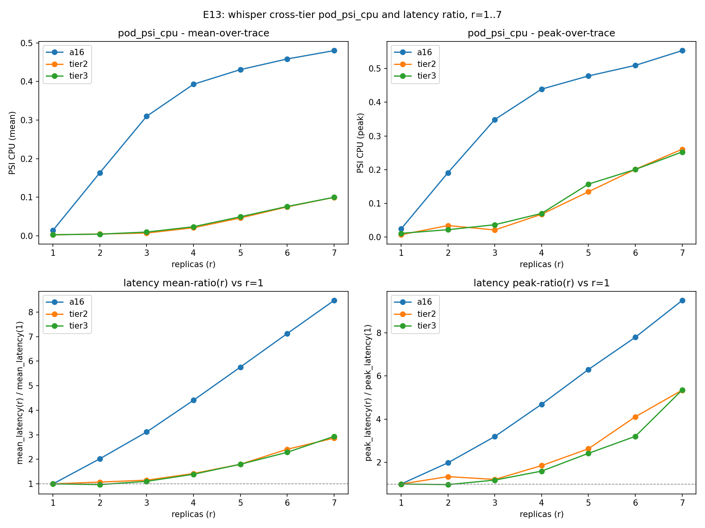

# E13 - whisper cross-tier CPU pressure / latency ratio (raw-CSV descriptive)

No model, no VR, no Wasserstein. Read via `tools/load_experiment.py` canonical schema aliasing (never a bare CSV read).

## HALT condition

A16 (phase1_v3) whisper r=1..7: all present and non-empty for `pod_psi_cpu` and `pod_latency_avg`. HALT condition not triggered.

## Per-(tier, r) table

| tier | r | psi_cpu mean | psi_cpu peak | latency mean | latency peak | mean-ratio vs r1 | peak-ratio vs r1 |
|---|---|---|---|---|---|---|---|
| a16 | 1 | 0.01441 | 0.02440 | 0.14022 | 0.14874 | 1.0000 | 1.0000 |
| a16 | 2 | 0.16356 | 0.19121 | 0.28364 | 0.29465 | 2.0229 | 1.9810 |
| a16 | 3 | 0.30984 | 0.34874 | 0.43678 | 0.47525 | 3.1151 | 3.1952 |
| a16 | 4 | 0.39269 | 0.43897 | 0.61800 | 0.69750 | 4.4075 | 4.6894 |
| a16 | 5 | 0.43062 | 0.47803 | 0.80732 | 0.93664 | 5.7577 | 6.2972 |
| a16 | 6 | 0.45819 | 0.50933 | 0.99872 | 1.15812 | 7.1227 | 7.7863 |
| a16 | 7 | 0.47981 | 0.55309 | 1.18780 | 1.41130 | 8.4713 | 9.4884 |
| tier2 | 1 | 0.00289 | 0.00719 | 0.12286 | 0.13214 | 1.0000 | 1.0000 |
| tier2 | 2 | 0.00489 | 0.03456 | 0.13196 | 0.17739 | 1.0741 | 1.3424 |
| tier2 | 3 | 0.00728 | 0.02141 | 0.14139 | 0.16008 | 1.1508 | 1.2114 |
| tier2 | 4 | 0.02108 | 0.06797 | 0.17473 | 0.24473 | 1.4222 | 1.8520 |
| tier2 | 5 | 0.04638 | 0.13472 | 0.22101 | 0.34765 | 1.7989 | 2.6308 |
| tier2 | 6 | 0.07514 | 0.20113 | 0.29609 | 0.54302 | 2.4100 | 4.1093 |
| tier2 | 7 | 0.09986 | 0.26073 | 0.35190 | 0.70585 | 2.8643 | 5.3415 |
| tier3 | 1 | 0.00287 | 0.01139 | 0.11553 | 0.14907 | 1.0000 | 1.0000 |
| tier3 | 2 | 0.00449 | 0.02222 | 0.11213 | 0.14506 | 0.9706 | 0.9731 |
| tier3 | 3 | 0.00986 | 0.03693 | 0.12755 | 0.17611 | 1.1040 | 1.1814 |
| tier3 | 4 | 0.02368 | 0.07051 | 0.16089 | 0.23813 | 1.3927 | 1.5975 |
| tier3 | 5 | 0.04943 | 0.15742 | 0.20784 | 0.36076 | 1.7990 | 2.4201 |
| tier3 | 6 | 0.07614 | 0.20081 | 0.26412 | 0.47766 | 2.2862 | 3.2043 |
| tier3 | 7 | 0.09987 | 0.25265 | 0.33902 | 0.79719 | 2.9345 | 5.3479 |

## Collapse-or-survive test (r=7)

- tier3_r7_mean_ratio = **2.9345**
- tier2_r7_mean_ratio = **2.8643**
- a16_r7_mean_ratio = **8.4713**
- tier3_r7_peak_ratio = **5.3479**
- tier2_r7_peak_ratio = **5.3415**
- a16_r7_peak_ratio = **9.4884**

Tier 2 and Tier 3 both ran on devlab with the same 16 vCPUs. If Tier 3's r=7 ratio is near Tier 2's (~2.86), the 'MIG preserves CPU contention' mechanism cannot hold and the story collapses. If Tier 3's ratio is meaningfully lower (say < 2.0 while Tier 2 ~2.86), the story survives but needs a subtler mechanism than raw same-vCPU contention.

**Mean-ratio verdict:** COLLAPSES (mean-ratio): tier3_r7=2.934 is close to tier2_r7=2.864 - Tier2 and Tier3 share the same 16 devlab vCPUs and produce similar mean-ratio ratios at r=7, so 'MIG preserves CPU contention' cannot explain a Tier2-vs-Tier3 difference in mean-ratio.

**Peak-ratio verdict:** COLLAPSES (peak-ratio): tier3_r7=5.348 is close to tier2_r7=5.342 - Tier2 and Tier3 share the same 16 devlab vCPUs and produce similar peak-ratio ratios at r=7, so 'MIG preserves CPU contention' cannot explain a Tier2-vs-Tier3 difference in peak-ratio.

If the effect shows in mean but not peak (or vice versa), that is itself diagnostic - it would suggest the mechanism is about sustained contention (mean) rather than transient spikes (peak), or the reverse.

